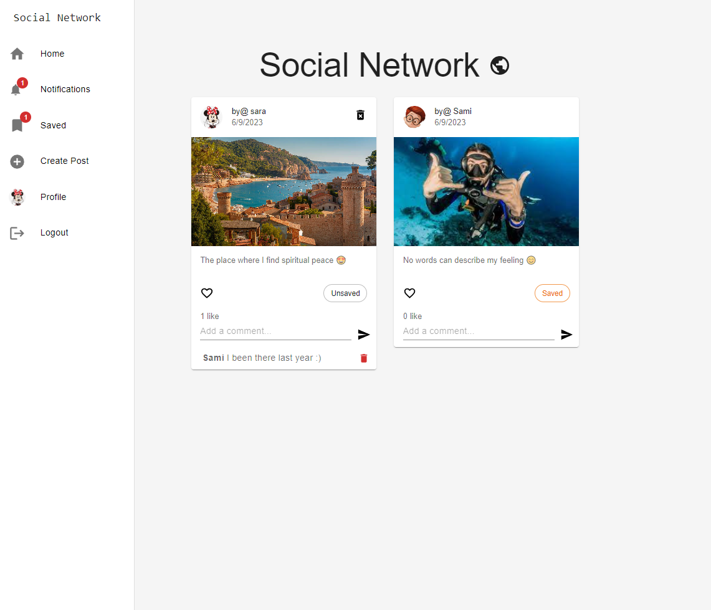
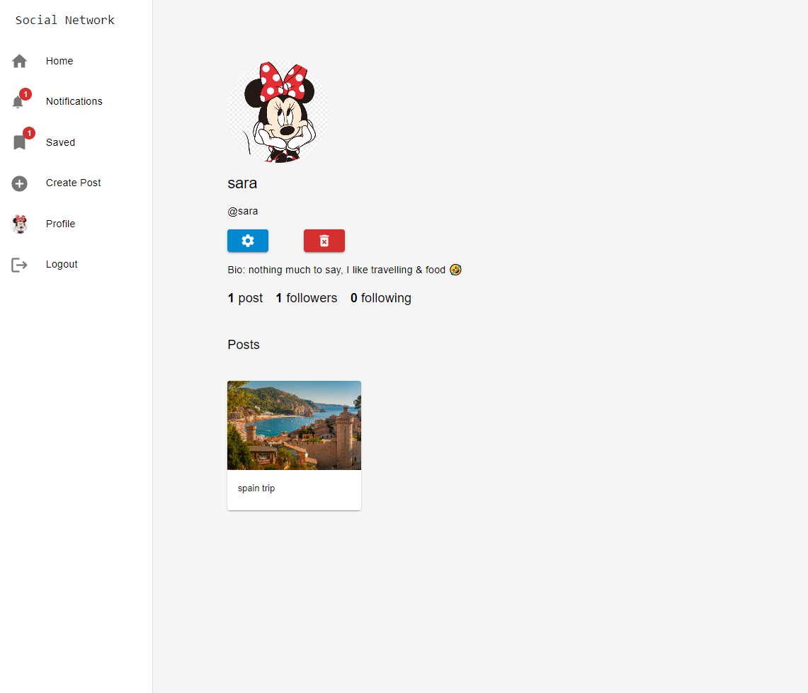

# Social Network Platform

> Social network platform built with Typescript  .





## Features

- Add - Update - Delete Posts
- Add & Remove comment
- Like & Unlike post
- Save & Unsave post
- Follow & Unfollow user
- User profile with details
- Get following notifications
- User profile with details
- Guest profile with details
- Image uploaded to the cloud

## Upcomming Features

- Post pagination
- Post search feature
- Google authenticated

## Usage

- Create a MongoDB database and obtain your `MongoDB URI` - [MongoDB Atlas](https://www.mongodb.com/cloud/atlas/register)

### Env Variables

Rename the `.env.example` file to `.env` and add the following

```
PORT = 5000
MONGO_URI = your mongodb uri
JWT_SECRET = your secret
NODE_ENV = development
```

### Install Dependencies (backend)

```
yarn
```
### Install Dependencies (frontend)

```
cd frontend
yarn
```

### Run

```

# Run frontend (:3000)
cd frontend
yarn start

 # Run backend (:5000)
yarn run server
```

## Tech

Frontend

- [React]
- [Redux]
- [Typescript]

Backend

- [node.js]
- [Express]
- [mongodb]
- [Typescript]

[React]: https://react.dev/
[Redux]: https://redux.js.org/tutorials/typescript-quick-start/
[Typescript]: https://www.typescriptlang.org/
[node.js]: http://nodejs.org
[express]: http://expressjs.com
[mongodb]: https://www.mongodb.com//
 